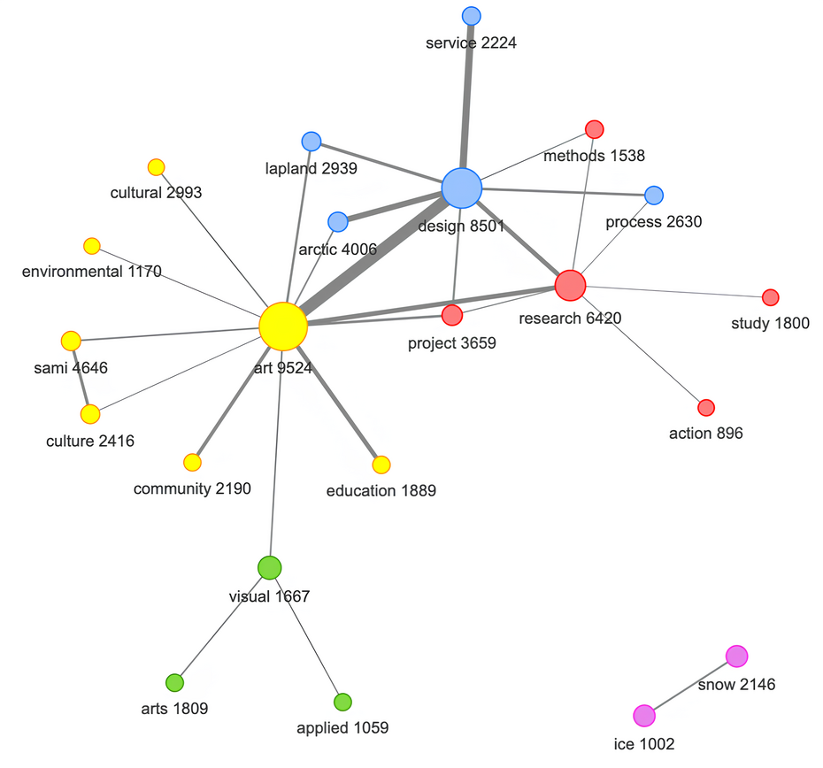

**Paper**: Кравчук С.Г., Коргин Н.А., Сергеев В.А. Арктический дизайн: опыт междисциплинарного конструирования предметной области // Журнал ВШЭ по искусству и дизайну. 2025. № 8 (4). С. 10-41. (Arctic Design: An Interdisciplinary Domain Design Experience)
https://art-journal.hse.ru/issue-4-2025/Svetlana-Kravchuk-Nikolai-Korgin-Vladimir-Sergeev_Arkticheskij-dizajn-opyt-mezhdisciplinarnogo-konstruirovaniya-predmetnoj-oblasti

The repository contains a section of code dedicated to data preparation for the terminology structure analysis project.

The results of the analysis are available at the following links:

1. The Northern European ("Finnish") approach to Arctic design (in English): [URL: https://lab57.shinyapps.io/arctic/].

2. The North American ("Canadian") approach (in English): [URL: https://lab57.shinyapps.io/arctic_na/].

3. The Russian ("Ural") approach (in Russian): [URL: https://lab57.shinyapps.io/arctic_rus/].

4. Results in Russian, translated into English: [URL: https://lab57.shinyapps.io/arctic_ruen/].

